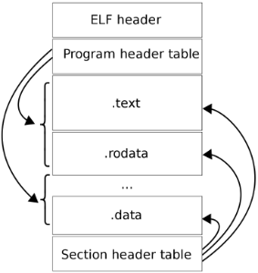
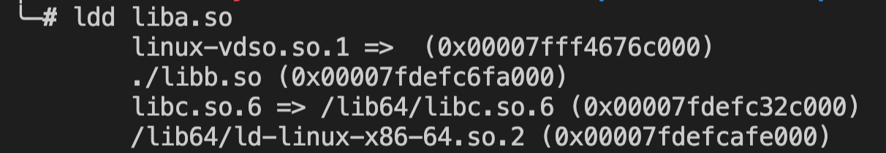
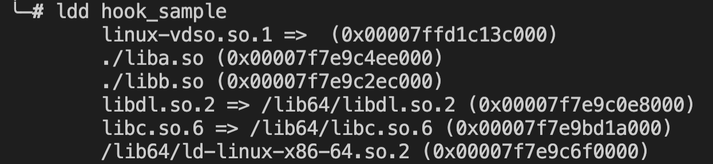
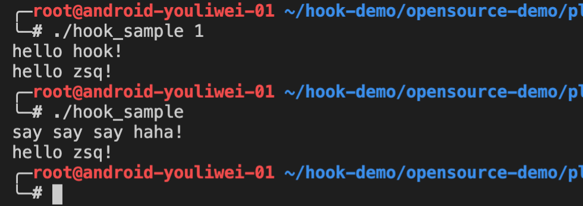
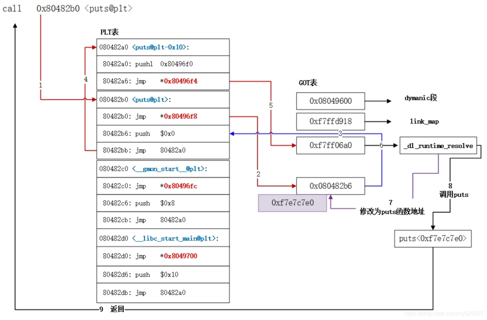
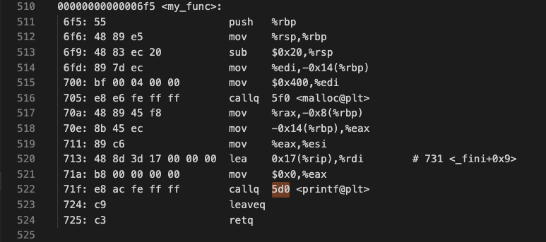
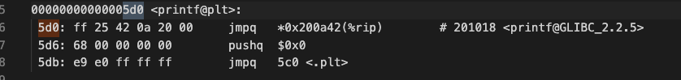
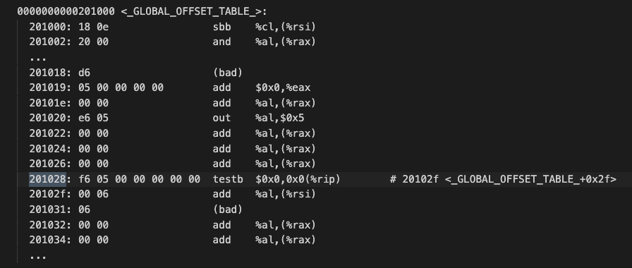
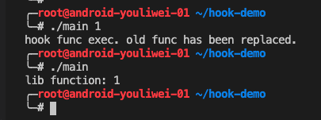

[[_TOC_]]

# 1 什么是PLT Hook？

在了解PLT Hook之前，我们先来介绍几个概念。

## 1.1 基本概念

### 1.1.1 Hook

Hook 直译为钩子，在技术领域指截获进程对某个 API 的调用，使得执行流程转向我们自定义的代码片段。

### 1.1.2 ELF

ELF(Executable and Linkable Format) 是一种类 Unix 操作系统的标准文件格式，用于二进制文件、可执行文件、目标文件、共享库和 core dump 文件等。

我们常见的动态库文件 so、Linux 下的可执行文件都是ELF格式。

ELF文件内部分为多个部分：

- ELF Header：文件头，表示文件基本信息。
- Program Header Table：ELF 以 segment 形式被加载进内存，此处记录 segment 的信息。
- section：表示具体的文件内容：代码、数据等等
- Section Header Table：存储各个 section 的信息



### 1.1.3 PLT & GOT

PLT(Procedure Linkage Table) 和 GOT(Global Offset Table) 均为 ELF 文件中的一个 section，用来存储外部库函数调用的相关信息。

在链接阶段，如果某函数定义在其他动态库中，那么此时无法知道该函数的具体地址。linker 会生成额外的代码片段，也就是 PLT 表中的内容，然后链接到该代码片段。

动态库函数被调用时（即运行阶段），会执行地址解析和重定位工作。此时动态库函数地址被写入 GOT 表中。

所以我们可以这么理解：

- GOT 用来存储外部库函数的绝对地址。
- PLT 由代码片段组成，该代码片段的作用是跳转到 GOT 中的对应位置。

参考文档：https://www.technovelty.org/linux/plt-and-got-the-key-to-code-sharing-and-dynamic-libraries.html


## 1.2 PLT Hook定义

在了解了上面几个概念后，现在来看看 PLT Hook：

PLT Hook 是指借助 PLT 和 GOT section 中的信息达到 Hook 的目的。换句话说，PLT Hook 依赖于 PLT、GOT section。

由于 PLT、GOT section 只存储外部库函数的信息，所以 PLT Hook 只能对库文件的外部库函数进行 hook，使用范围比较受限。

接下来我们通过一个 demo 来看看 PLT Hook 的具体功能。

# 2 开源 PLT Hook 的使用demo

整体思路为：

- 生成两个库 liba.so 和 libb.so ，并且 liba.so 调用 libb.so 的接口 say()
- 调用开源 PLT Hook 接口，将 liba.so 的 say() 替换成另一个函数 my_hello()

先定义两个源文件 a.c 和 b.c，a.c 调用 b.c 的方法

**a.c file:**

```c
#include <stdio.h>
 
extern void say();
 
void say_hello() {
  say();
  printf("hello zsq!\n");
}
```

**b.c file:**

```c
#include <stdio.h>
 
void say() {
  printf("say say say haha!\n");
}
```

使用下列命令生成对应的库文件 liba.so和 libb.so：

```bash
$ gcc -shared -fPIC -o libb.so b.c
$ gcc -shared -fPIC -o liba.so a.c ./libb.so
```

查看 liba.so 依赖的库：



调用[开源的PLT Hook接口](https://github.com/kubo/plthook)，实现 Hook：

**hook_sample.c file:**

```c
#include "plthook.h"
#include <stdio.h>
 
extern say_hello();
 
static void my_hello()
{
  printf("hello hook!\n");
}
     
int install_hook_function() {
    plthook_t *plthook;
     
    if (plthook_open(&plthook, "liba.so") != 0) {
        printf("plthook_open error: %s\n", plthook_error());
        return -1;
    }
    if (plthook_replace(plthook, "say", (void*)my_hello, NULL) != 0) {
        printf("plthook_replace error: %s\n", plthook_error());
        plthook_close(plthook);
        return -1;
    }
    plthook_close(plthook);
    return 0;
}
 
int main(int argc, char* argv[]) {
  if(argc > 1){
    install_hook_function();
  }
  say_hello();
  return 0;
}
```

使用下列命令生成可执行文件：

```bash
$ gcc -o hook_sample hook_sample.c plthook_elf.c ./liba.so ./libb.so -ldl
```

hook_sample依赖的库有：



输出结果如下图，参数表示开启 Hook：



从输出结果可以看出，调用 install_hook_function 之后，say() 函数被替换为 my_hello()。

# 4 PLT Hook 原理

PLT Hook 通过解析 ELF 文件的 PLT 和 GOT section 的内容，再结合库的加载基地址，定位到外部库函数的存放地址，然后将其修改为自定义函数地址。

这样，每次在调用外部库函数时，实际执行的是自定义函数。

下面我们依次分析：

1. 库的基地址：    

​    程序运行时，动态链接器(比如Linux下的ld-linux-x86-64.so)负责将相关动态库加载进内存， 这时，每一个动态库都有一个起始地址，即此处需要的基地址。

​    为了拿到这个地址，可以通过解析 /proc/"pid"/maps 文件获得。

​    /proc 是一个虚拟文件系统，用来存储当前内核状态信息。maps 用来存储进程共享区的映射信息。


2. PLT & GOT 解析：

​    发生函数调用时，PLT 和 GOT 中的指令被依次解析。

​    PLT Hook 通过函数名定位到 PLT 中相关内容，然后解析出 GOT 中的存放地址，此地址是一个相对地址。

​    在下图中，其流程为：函数调用 → PLT → GOT → 函数实际地址。



3. 修改存放地址内容

​    将基地址和偏移地址相加后，得到外部库函数的存放地址，修改存放地址的内容即可。

​    在系统中，每一段内容都有对应权限。为了修改存放地址，需要先设置写入权限。之后再清除指令缓存，才能使该修改生效。

# 5 基于PLT Hook 原理的 demo

整体思路为：

- 生成库文件 libmyfunc.so，该库调用系统库函数 printf
- 通过反汇编手段，找出 libmyfunc.so 中 printf 的 PLT、GOT信息，计算出 printf 的相对地址
- 将该地址修改为自定义函数地址

## 5.1 自定义库

生成 my_func.h 和 my_func.c 文件：

**my_func.h file:**

```C
#ifndef MY_FUNC_H_
#define MY_FUNC_H_
 
void my_func(int);
 
#endif //#ifndef MY_FUNC_H_
```

**my_func.c file:**

```c
#include "my_func.h"
 
#include <stdio.h>
 
void my_func(int input){
    printf("lib function: %d\n",input);
}
```

使用以下命令生成库文件：

```bash
$ gcc -shared -fPIC -o libmyfunc.so my_func.c
```

## 5.2 获取偏移地址

生成汇编代码文件 assembly.info：

```bash
$ objdump -D libmyfunc.so > assembly.info
```

在 assembly.info 中找出偏移地址：





在GOT中验证该地址是否存在：	



## 5.3 自定义hook函数

```C
#include <stdio.h>
#include <inttypes.h>
#include <unistd.h>
#include <stdlib.h>
#include <stdio.h>
#include <sys/mman.h>
 
extern void my_func(int);
 
#define PAGE_SIZE 4096  // only in demo
#define PAGE_MASK 0xfffff000 // only in demo
#define PAGE_START(addr) ((addr) & PAGE_MASK)
#define PAGE_END(addr)   (PAGE_START(addr) + PAGE_SIZE)
 
static void hook_my_func_replace(){//自定义函数
    printf("hook func exec. old func has been replaced.\n");// this function will not be hooked.
}
 
void hook()//执行Hook动作
{
    char       line[1024];
    FILE      *fp;
    uintptr_t  base_addr = 0;
    uintptr_t  addr;
 
    if(NULL == (fp = fopen("/proc/self/maps", "r"))) return;//读取所有so信息
    while(fgets(line, sizeof(line), fp))
    {
        if(NULL != strstr(line, "libmyfunc.so")
        && sscanf(line, "%"PRIxPTR"-%*lx %*4s 00000000", &base_addr) == 1)//定位到自定义库，并查找偏移为0的地址
            break;
    }
    fclose(fp);
    if(0 == base_addr) return;
 
    addr = base_addr + 0x201018;// 外部库函数的存放地址 = 基地址 + 偏移量
 
    mprotect((void *)PAGE_START(addr), PAGE_SIZE, PROT_READ | PROT_WRITE);//设置写入权限
 
    *(void **)addr = hook_my_func_replace;//修改为自定义函数地址
 
    __builtin___clear_cache((void *)PAGE_START(addr), (void *)PAGE_END(addr));//清除缓存
}
 
 
int main(int argc, char* argv[]){
    if(argc > 1){
        hook();
    }
    else{
        //do nothing
    }
 
    my_func(1);
    sleep(60);// check so info
 
    return 0;
}
```

使用以下命令生成可执行文件：

```bash
$ gcc -o main main.c ./libmyfunc.so
```

执行结果：



## 5.4 结论

在调用 hook 函数之后，库中的 printf 函数被替换为自定义函数，不会执行，自定义函数被调用。

同时发现 hook_my_func_replace 函数中的 printf 被调用，这是因为 main 中的 printf 和 库中 的 printf 地址是分开处理的。

证明 PLT Hook 只对指定库的指定函数起作用。

